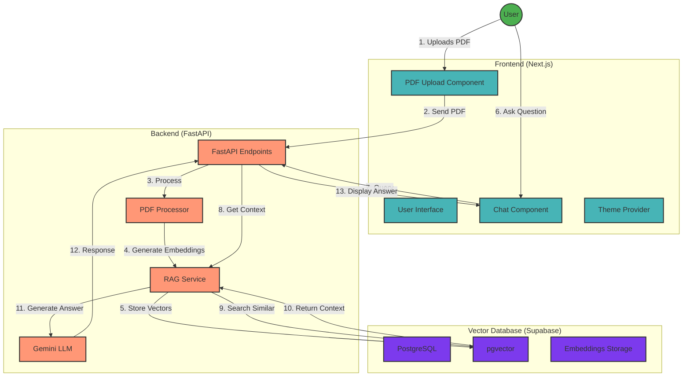

# RAG AI Application

A Retrieval-Augmented Generation (RAG) application that enables users to chat with their PDF documents using Google's Gemini AI model.

This is for my personal experiment use only & educational purposes.

## Features

- PDF document upload and processing
- Vector embeddings generation using Gemini API
- Similarity search using pgvector
- Conversational AI with context from uploaded documents
- Dark/Light mode support
- User-provided API key management

## Tech Stack

### Frontend

- Next.js 14
- React
- Flowbite UI Components
- TailwindCSS

### Backend

- FastAPI
- LangChain
- Google Gemini API
- PyPDF

### Database

- Supabase
- PostgreSQL with pgvector extension

## Technical Architecture

## Flow Description

1. **PDF Upload Flow**

   - User uploads a PDF document
   - Frontend sends the file to Backend
   - Backend processes PDF into chunks
   - Gemini API generates embeddings
   - Vectors are stored in Supabase pgvector

2. **Chat Flow**
   - User sends a question
   - Backend searches for relevant context
   - Similar vectors are retrieved
   - Gemini API generates response
   - Answer is displayed to user

## System Components

### Frontend Components

- **PDF Upload**: Handles document upload
- **Chat Interface**: Manages conversation
- **Theme Provider**: Controls dark/light mode
- **API Key Management**: Secures user credentials

### Backend Services

- **FastAPI Endpoints**: REST API interface
- **RAG Service**: Core retrieval-augmented generation
- **PDF Processor**: Document chunking and processing
- **LLM Integration**: Gemini API communication

### Database Structure

- **PostgreSQL**: Base database system
- **pgvector**: Vector similarity search
- **Embeddings**: Document vector storage

## Security Considerations

- User API keys stored locally
- Secure communication over HTTPS
- No permanent storage of uploaded documents
