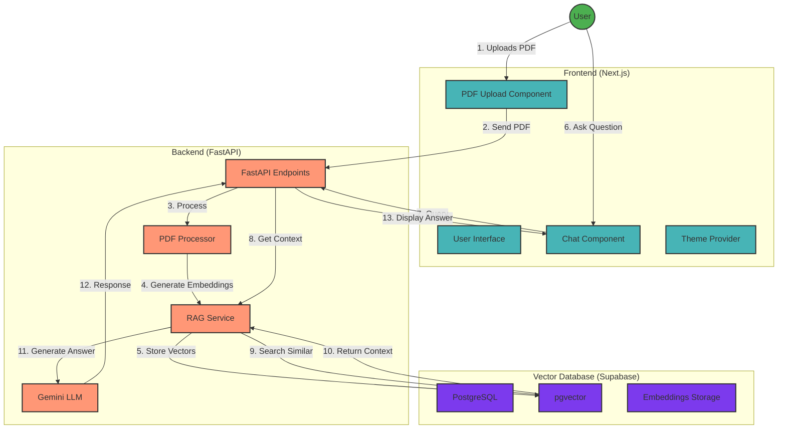

# RAG AI Application

A Retrieval-Augmented Generation (RAG) application that enables users to chat with their PDF documents using Google's Gemini AI model.

This is for my personal experiment use only & educational purposes.

## Features

- PDF document upload and processing
- Vector embeddings generation using Gemini API
- Similarity search using pgvector
- Conversational AI with context from uploaded documents
- Dark/Light mode support
- User-provided API key management

## Tech Stack

### Frontend

- Next.js 14
- React
- Flowbite UI Components
- TailwindCSS

### Backend

- FastAPI
- LangChain
- Google Gemini API
- PyPDF

### Database

- Supabase
- PostgreSQL with pgvector extension

## Technical Architecture



## Flow Description

1. **PDF Upload Flow**

   - User uploads a PDF document
   - Frontend sends the file to Backend
   - Backend processes PDF into chunks
   - Gemini API generates embeddings
   - Vectors are stored in Supabase pgvector

2. **Chat Flow**
   - User sends a question
   - Backend searches for relevant context
   - Similar vectors are retrieved
   - Gemini API generates response
   - Answer is displayed to user

## System Components

### Frontend Components

- **PDF Upload**: Handles document upload
- **Chat Interface**: Manages conversation
- **Theme Provider**: Controls dark/light mode
- **API Key Management**: Secures user credentials

### Backend Services

- **FastAPI Endpoints**: REST API interface
- **RAG Service**: Core retrieval-augmented generation
- **PDF Processor**: Document chunking and processing
- **LLM Integration**: Gemini API communication

### Database Structure

- **PostgreSQL**: Base database system
- **pgvector**: Vector similarity search
- **Embeddings**: Document vector storage

## Security Considerations

- User API keys stored locally
- Secure communication over HTTPS
- No permanent storage of uploaded documents

## Local Development Setup

### Prerequisites

- Node.js 18+ and npm
- Python 3.9+
- Supabase account
- Google (Gemini) API key

### 1. Clone the Repository

```bash
git clone https://github.com/paanjoe/RAG-AI-Agent.git
cd RAG-AI-Agent
```

### 2. Frontend Setup

```bash
# Navigate to frontend directory
cd frontend

# Install dependencies
npm install

# Create .env.local file
echo "NEXT_PUBLIC_API_URL=http://localhost:8000/api" > .env.local

# Start development server
npm run dev
```

The frontend will be available at `http://localhost:3000`

### 3. Backend Setup

```bash
# Navigate to backend directory
cd backend

# Create virtual environment
python -m venv venv

# Activate virtual environment
# For Windows:
.\venv\Scripts\activate
# For macOS/Linux:
source venv/bin/activate

# Install dependencies
pip install -r requirements.txt

# Create .env file
touch .env
```

### 4. Configure Environment Variables

Create a `.env` file in the backend directory with the following:

```plaintext
GOOGLE_API_KEY=your_gemini_api_key
SUPABASE_URL=your_supabase_project_url
SUPABASE_SERVICE_KEY=your_supabase_service_role_key
```

### 5. Supabase Database Setup

1. Create a new Supabase project
2. Enable Vector extension in SQL Editor:

```sql
-- Enable the pgvector extension
create extension if not exists vector;

-- Create documents table
create table if not exists documents (
  id bigserial primary key,
  content text,
  metadata jsonb,
  embedding vector(768)
);

-- Create function for similarity search
create or replace function match_documents (
  query_embedding vector(768),
  match_count int DEFAULT 3
) returns table (
  id bigint,
  content text,
  metadata jsonb,
  similarity float
)
language plpgsql
as $$
begin
  return query
  select
    documents.id,
    documents.content,
    documents.metadata,
    1 - (documents.embedding <=> query_embedding) as similarity
  from documents
  order by documents.embedding <=> query_embedding
  limit match_count;
end;
$$;
```

### 6. Start the Backend Server

```bash
# From the backend directory with virtual environment activated
uvicorn app.main:app --reload
```

The backend API will be available at `http://localhost:8000`

### 7. Testing the Application

1. Open `http://localhost:3000` in your browser
2. Enter your Gemini API key in the input field
3. Upload a PDF file
4. Start chatting with your document!

### Common Issues and Solutions

1. **CORS Errors**

   - Ensure frontend URL is correctly set in backend CORS configuration
   - Check if API URL in frontend matches backend URL

2. **Database Connection Issues**

   - Verify Supabase credentials in `.env`
   - Ensure pgvector extension is enabled
   - Check if tables and functions are created properly

3. **PDF Upload Issues**

   - Check file size limits
   - Ensure proper file type validation
   - Verify backend storage configuration

4. **API Key Issues**
   - Ensure Gemini API key is valid
   - Check if API key is properly passed in requests
   - Verify environment variables are loaded correctly
